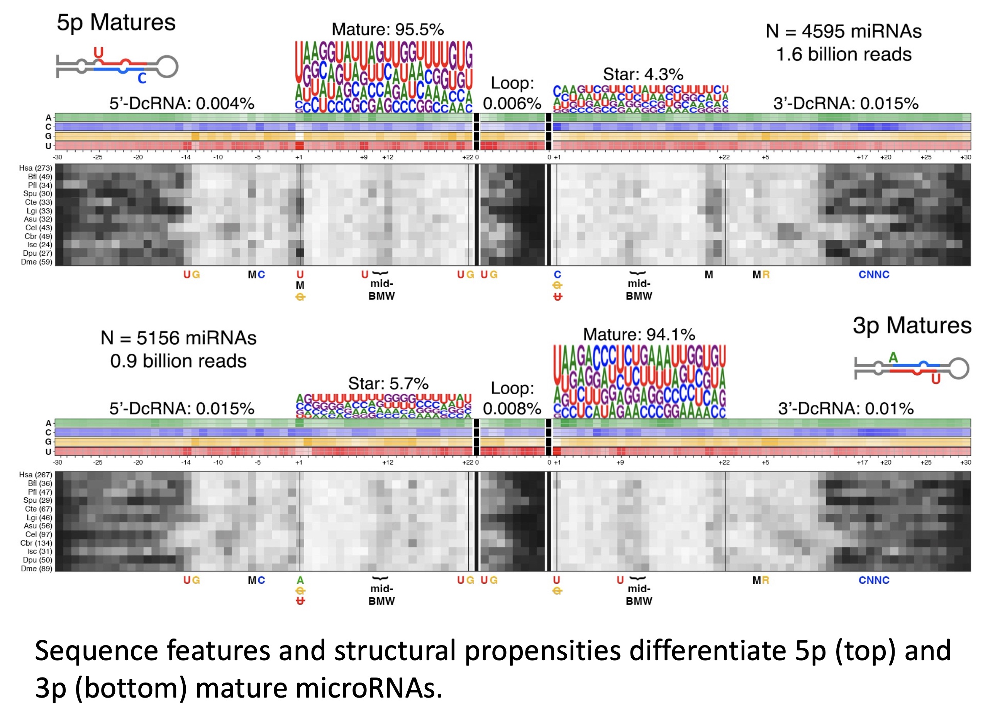

Correlomics: uncovering microRNA editing and structural features based on reference and sequencing data.

This is an in development repository for the correlomics project where we explore novel miRNA features.

Pipeline for smallRNA sequencing data. 

Processing and quality control of sequencing data using MirTrace. Returns fasta files with collapsed reads.

Generates microRNA reference library from MirGeneDB mature and star microRNA sequences, which are extended with 5 nucleotides at the 5p and 3p end from the genomic loci. 

Generate bowtie reference for each species, bowtie v=1.0.0. 

Map collapsed reads, allowing up to 10 alignments with up to 3 mismatches. Outputs sam files.

Use two separate filtering methods for sam files, to filter for multiple read alignments:
- One selecting for mismatches INSIDE miRNA position 2-18
    - Used for identifying microRNA editing events, including A to I editing.
- One selecting for mismatches OUTSIDE miRNA position 2-18
    - Used for analyzing the preferred read alignment position (0 is canonical start/end).

Parse samfiles Identify A to I editing events and merge all into a long format dataframe

Parse samfiles to identify read start and end position

Get unbiased foldings for all pri-miRNA sequences using mfold.
- Check each fold to assess misfold, if yes then refold using successively stricter criteria until a "legal" fold is obtained.

Use fold to search for sequential and structural motifs in the miRNA stem.

 

TODO
- Finish snakemake integration.
- Add the A to I samfile parser to the main correlomics script.
- merge/remove redundant scripts.
- Update pipeline diagram in README.
- Test on latest version of MirGeneDB with smallRNA-seq at SAGA.

Visualisation of sequential and structural features across phyla, which may be involved in mature star strand selection (grayscale plot represent frequency of bulges at that hairpin position):

